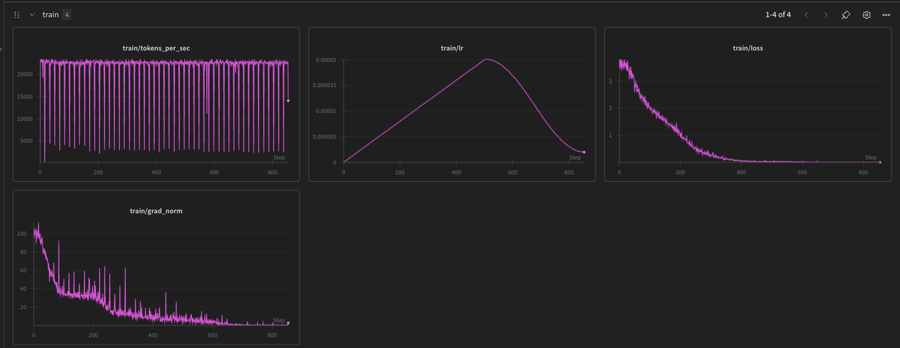
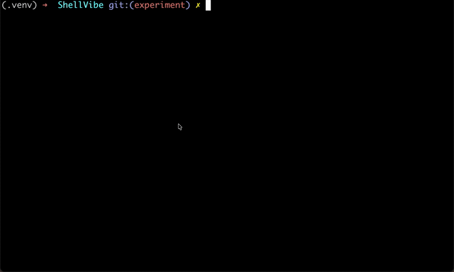

# ShellVibe

Natural language → shell command (fine-tuned `Qwen/Qwen2.5-Coder-0.5B`).

## Install

```bash
brew install uv
uv sync
```

## Training



## Demo



## Download model weights (required)

1. Download a `.pt` from:

   <https://drive.google.com/drive/folders/1p7kHSM026taNygr955ef-siSQKdGFCGn?usp=sharing>

2. Put it in `checkpoints/` (e.g. `checkpoints/best_edit_distance.pt`).

## Run inference

### vibe CLI (recommended)

The `vibe` CLI loads the model once into a background server so every subsequent call is fast (~1s). The server starts automatically on first use.

**Setup** — add to your `~/.zshrc` or `~/.bashrc`:

```bash
vibe() {
    uv run python /path/to/ShellVibe/vibe.py "$@"
}
```

Then reload your shell:

```bash
source ~/.zshrc
```

**Usage:**

```bash
vibe list all files recursively
vibe "show disk usage in human readable format"
```

Quotes are optional — both forms work. When a command is generated you get an accept/reject prompt. Accepting appends the command to `~/.vibe_history.sh` with a timestamp — nothing is executed automatically.

**Stop the background server** when you're done:

```bash
make vibe-stop
# or: pkill -f vibe_server.py
```

### Single instruction (no daemon)

```bash
make inference INSTRUCTION="list all files recursively and show sizes"
```

### Interactive mode (no daemon)

```bash
make inference-interactive
```

## Examples

Always review commands before running them.

```text
Instruction: list all files including hidden
Command:     ls -a

Instruction: what is my current directory
Command:     pwd

Instruction: show git status
Command:     git status

Instruction: count lines in README.md
Command:     wc -l README.md

Instruction: find all python files under src
Command:     find src -name '*.py'

Instruction: extract logs.tar.gz into current directory
Command:     tar xf logs.tar.gz

Instruction: can you provide the command to decompress logs.gz?
Command:     gzip -cd logs.gz > logs.txt
```
