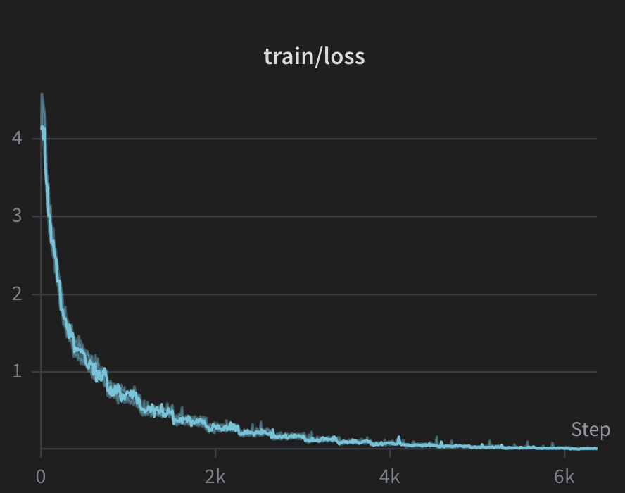
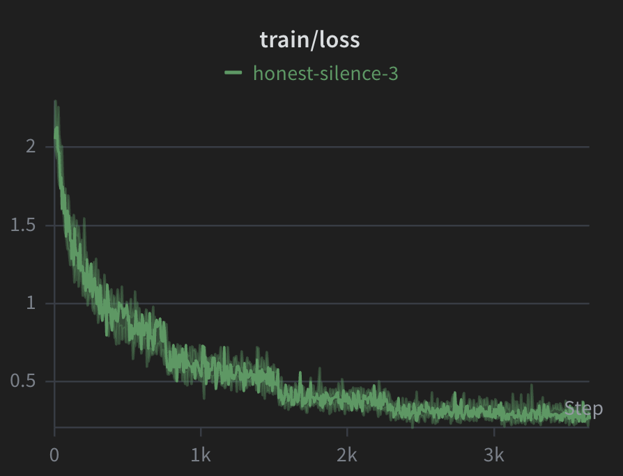
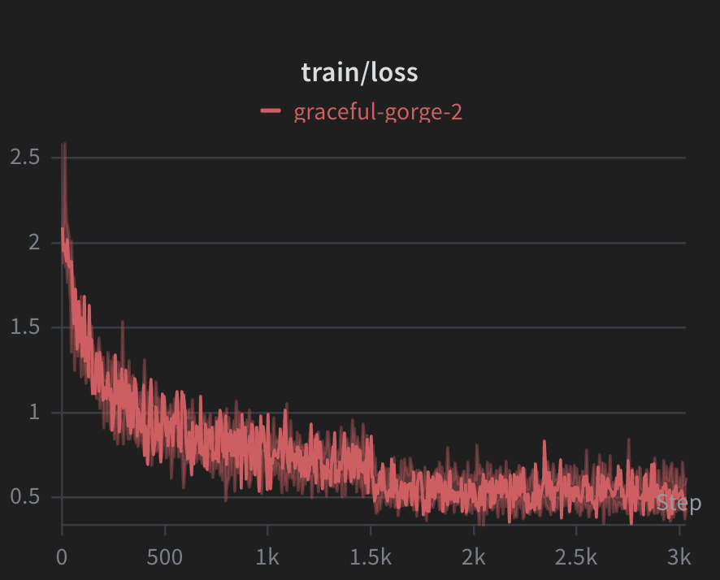

# ShellVibe

> Type what you want. Get the shell command.

ShellVibe is a family of fine-tuned language models that translate plain English into shell commands — running **fully local**, with no API keys or internet connection required.


---

## Why ShellVibe?

Most developers waste time Googling arcane flags or piping through `man` pages. ShellVibe puts a fine-tuned model directly in your terminal: describe your intent, get the exact command.

- **Fully local** — no API keys, no data sent anywhere
- **Three model sizes** — choose speed vs. accuracy for your hardware
- **GGUF format** — runs efficiently on CPU and Apple Silicon via llama.cpp
- **Trained on real shell data** — sourced from [tldr-pages](https://github.com/tldr-pages/tldr), covering macOS and Linux

> **⚠️ Always verify generated commands before running them.** ShellVibe can make mistakes — especially with complex flags or destructive operations (`rm`, `chmod`, `dd`, etc.). Treat the output as a suggestion, not a guarantee.

---

## Models

All models are fine-tuned from Qwen2.5-Coder-Instruct and trained on an **NVIDIA A100 (bf16)**.

| Model | Base | Size | W&B Training Logs |
|-------|------|------|-------------------|
| ShellVibe-0.5B | Qwen2.5-Coder-0.5B-Instruct | ~500MB | [view run](https://wandb.ai/personal-nlp-projects/qwen-coder-bash-sft/runs/epo4qon0?nw=nwuserhrithickcodes) |
| ShellVibe-1.5B | Qwen2.5-Coder-1.5B-Instruct | ~1.5GB | [view run](https://wandb.ai/personal-nlp-projects/qwen2.5-coder-1.5b-sft?nw=nwuserhrithickcodes) |
| ShellVibe-3B | Qwen2.5-Coder-3B-Instruct | ~3GB | [view run](https://wandb.ai/personal-nlp-projects/qwen2.5-coder-3b-sft?nw=nwuserhrithickcodes) |

### Training Loss

<table>
  <tr>
    <td align="center"><b>0.5B</b></td>
    <td align="center"><b>1.5B</b></td>
    <td align="center"><b>3B</b></td>
  </tr>
  <tr>
    <td></td>
    <td></td>
    <td></td>
  </tr>
</table>

---

## Quick Start

### 1. Install dependencies

```bash
brew install uv
uv sync
```

### 2. Download a GGUF model

Download the `gguf-models/` folder from [Google Drive](https://drive.google.com/drive/folders/1p7kHSM026taNygr955ef-siSQKdGFCGn?usp=sharing) and place it at the root of the repo.

```
gguf-models/
├── qwen2.5-0.5b-inst-q8_0.gguf
├── qwen2.5-1.5b-inst-q8_0.gguf
└── qwen2.5-3b-inst-q8_0.gguf
```

### 3. Run inference

Pick a model size and run — backend is **auto-detected** (Metal on macOS, CPU otherwise):

```bash
make run-0.5b   # fastest, lightest
make run-1.5b   # balanced
make run-3b     # most accurate
```

Tokens/second is displayed after each response.

---

## Training

The models were fine-tuned using supervised fine-tuning (SFT) on shell command data derived from [tldr-pages](https://github.com/tldr-pages/tldr). Training was done on an **NVIDIA A100** with **bf16 precision**.

### Data pipeline

```bash
make preprocess-tldr   # parse TLDR markdown pages → CSV
```

### Train

```bash
make train
```

Checkpoints are saved automatically on best validation loss and best edit-distance score. Training metrics are logged to Weights & Biases.

---

## License

GPL
