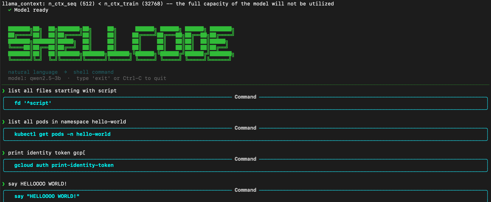

# ShellVibe

> Turn plain English into shell commands.

Fine-tuned `Qwen2.5-Coder-3B-Instruct` — runs fully local, no API keys.



## Setup

```bash
brew install uv
uv sync
```

## Checkpoints

Download from [Google Drive](https://drive.google.com/drive/folders/1p7kHSM026taNygr955ef-siSQKdGFCGn?usp=sharing) and place in `checkpoints/`.

| File | Description |
|------|-------------|
| `best_loss.pt` | Lowest validation loss |
| `best_edit_distance.pt` | Best edit-distance metric |
| `best-tested-manual.pt` | Best manually tested checkpoint |

## Inference

`.pt` — single shot:
```bash
make inference INSTRUCTION="list all files recursively and show sizes"
```

`.pt` — interactive:
```bash
make inference-interactive
```

GGUF — single shot:
```bash
make inference-gguf GGUF=gguf-models/best_edit_distance.gguf \
                    INSTRUCTION="kill process on port 8080"
```

GGUF — interactive:
```bash
make inference-gguf GGUF=gguf-models/best_edit_distance.gguf
```

## Export

`.pt` → HuggingFace:
```bash
make export-hf CHECKPOINT=checkpoints/best_edit_distance.pt \
               MODEL_ID=hf-models/qwen-3b-inst \
               HF_DIR=hf-models/best_edit_distance
```

HuggingFace → GGUF (f16):
```bash
make export-gguf HF_DIR=hf-models/best_edit_distance \
                 GGUF_OUT=gguf-models/best_edit_distance.gguf
```

All checkpoints in one shot:
```bash
make convert-all MODEL_ID=hf-models/qwen-3b-inst
```

## Training

```bash
make train
```

Logs to W&B. Checkpoints saved to `checkpoints/` on best loss and best edit-distance.

## Data pipeline

```bash
make preprocess-tldr   # parse TLDR pages → CSV
```
